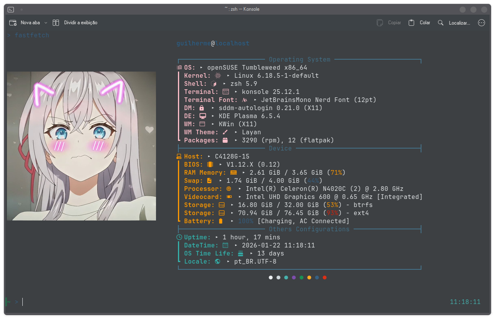

# Alya Fastfetch Dotfiles



# INSTALLATION

## Requisits

* Git
* Nerd Fonts

## Install

To install the fastfetch config, use:

```bash
git clone https://github.com/Vapor55/Alya-Fastfetch-Dotfiles.git ~/.config/fastfetch
```

Optional: Remove the .git folder

```bash
rm -rf ~/.config/fastfetch/.git
```

# Credits

This fastfetch configuration is the modified version for [Sofijacom Dotfiles Fastfetch](https://github.com/sofijacom/dotfiles-fastfetch).
